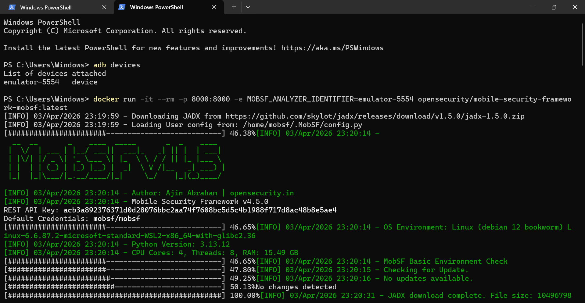
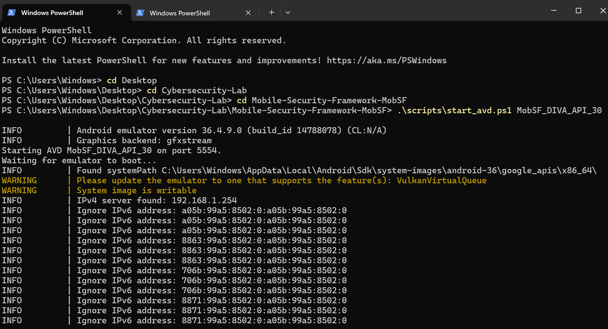
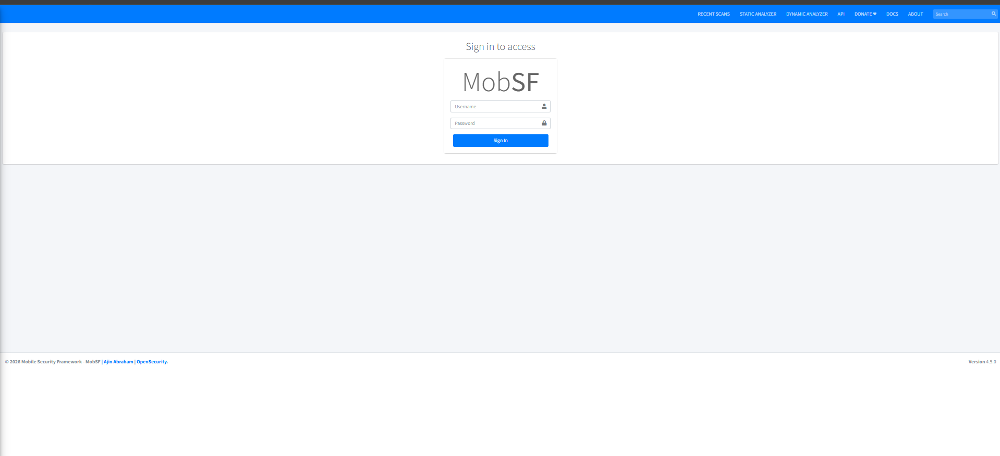
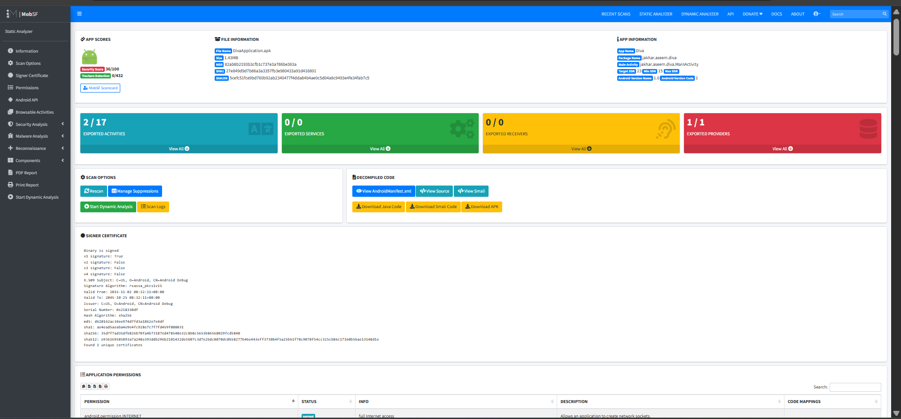
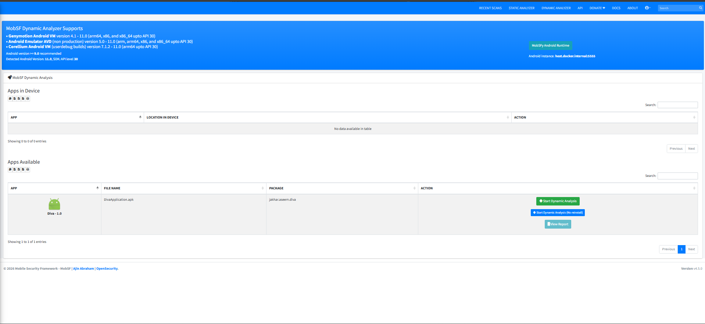
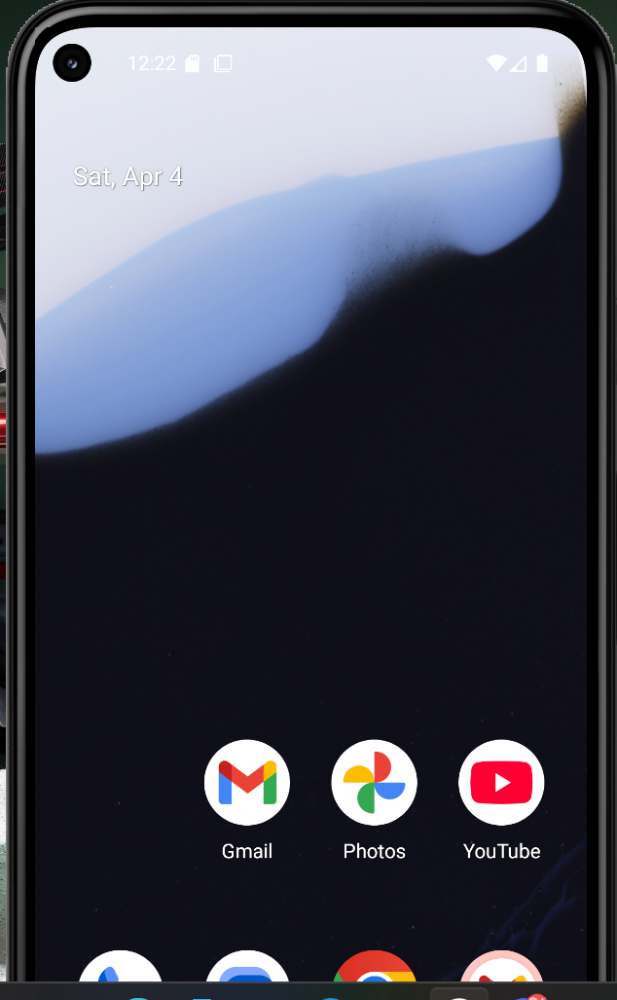
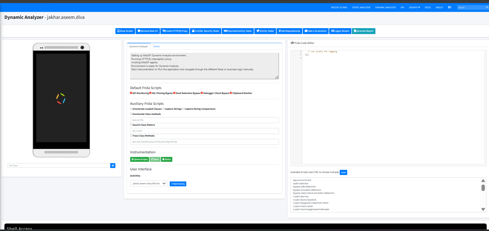
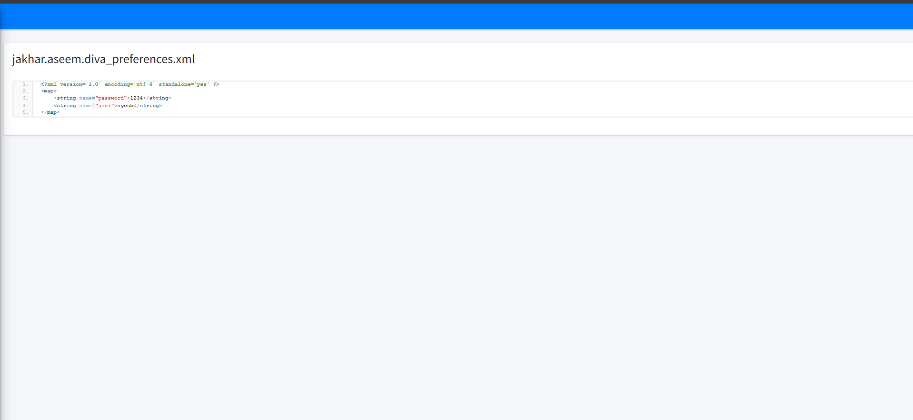
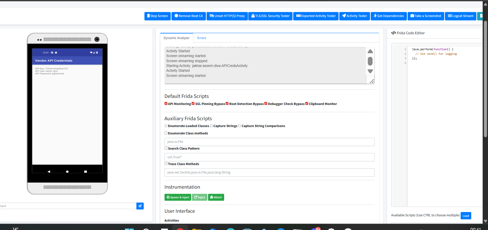
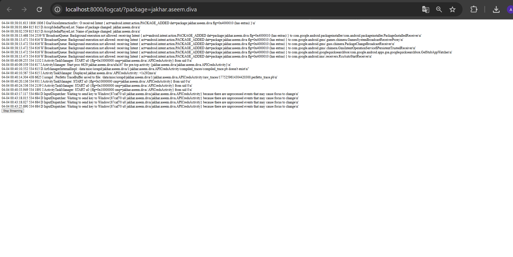

# 📱 Mobile Security Analysis — DIVA Android App with MobSF

> **Auteur :** Kaoutar Menacera  
> **Outil :** Mobile Security Framework (MobSF) v4.5.0  
> **Cible :** DIVA (Damn Insecure and Vulnerable App) — `jakhar.aseem.diva`  
> **Environnement :** Windows + Docker + Android Emulator (AVD API 30)

---

## 📋 Table des Matières

- [Présentation](#présentation)
- [Environnement & Prérequis](#environnement--prérequis)
- [Mise en Place](#mise-en-place)
- [Analyse Statique](#analyse-statique)
- [Analyse Dynamique](#analyse-dynamique)
- [Vulnérabilités Découvertes](#vulnérabilités-découvertes)

---

## 🧾 Présentation

Ce projet présente une analyse de sécurité mobile complète de l'application **DIVA Android** en utilisant le framework **MobSF**. L'objectif est d'identifier les vulnérabilités courantes dans les applications mobiles Android, notamment le stockage non sécurisé de données, les credentials exposés en clair, et les fuites via les logs.

---

## 🛠 Environnement & Prérequis

- Windows 11 + PowerShell
- Docker Desktop
- Android SDK + AVD (Android Virtual Device)
- MobSF via Docker (`opensecurity/mobile-security-framework-mobsf:latest`)
- ADB (Android Debug Bridge)

---

## 🚀 Mise en Place

### 1. Lancer MobSF via Docker

```powershell
adb devices
docker run -it --rm -p 8000:8000 -e MOBSF_ANALYZER_IDENTIFIER=emulator-5554 opensecurity/mobile-security-framework-mobsf:latest
```



---

### 2. Démarrer l'émulateur Android (AVD)

```powershell
cd Desktop\Cybersecurity-Lab\Mobile-Security-Framework-MobSF
.\scripts\start_avd.ps1 MobSF_DIVA_API_30
```



---

### 3. Se connecter à MobSF

Accéder à `http://localhost:8000` avec les credentials par défaut :

```
Username: mobsf
Password: mobsf
```



---

## 🔍 Analyse Statique

L'APK `DivaApplication.apk` (package : `jakhar.aseem.diva`) est uploadé dans MobSF pour analyse statique.

**Résultats clés :**
- **Security Score : 36/100**
- 2/17 Exported Activities
- 1/1 Exported Provider (risque élevé)
- Signature v1 uniquement (vulnérable)
- Permissions dangereuses détectées



---

## ⚙️ Analyse Dynamique

### 4. Lancer l'analyse dynamique

Depuis le **Dynamic Analyzer**, sélectionner `DivaApplication.apk` et cliquer sur **Start Dynamic Analysis**.



---

### 5. Émulateur Android

L'émulateur tourne sous Android API 30, connecté à MobSF via ADB sur le port 5554.



---

### 6. Instrumentation avec Frida

MobSF intègre **Frida** pour l'instrumentation runtime. Scripts activés :

- ✅ API Monitoring
- ✅ SSL Pinning Bypass
- ✅ Root Detection Bypass
- ✅ Debugger Check Bypass
- ✅ Clipboard Monitor



---

## 🔓 Vulnérabilités Découvertes

### 🔴 Insecure Data Storage — Part 1

**Objectif :** Trouver comment les credentials sont stockés et identifier le code vulnérable.

L'utilisateur entre ses credentials dans l'application :


Les données sont sauvegardées en **SharedPreferences en clair** dans le fichier XML suivant :

**Fichier :** `jakhar.aseem.diva_preferences.xml`

```xml
<?xml version='1.0' encoding='utf-8' standalone='yes' ?>
<map>
    <string name="password">1234</string>
    <string name="user">ayoub</string>
</map>
```

> ⚠️ **Vulnérabilité critique :** Le mot de passe est stocké en **texte clair** sans aucun chiffrement.



---

### 🟠 Hardcoded API Credentials

Via le **Dynamic Analyzer**, l'activité `APICredsActivity` expose des credentials API codés en dur dans l'interface :

```
API Key:       123secretapikey123
API User name: diva
API Password:  p@ssword
```

> ⚠️ **Vulnérabilité critique :** Les credentials sont hardcodés dans le code source de l'application.



---

### 🟡 Log Leakage

Le **Logcat Stream** révèle des informations sensibles sur les activités lancées et les packages installés, accessibles via :

```
http://localhost:8000/logcat/?package=jakhar.aseem.diva
```



---

## ⚠️ Avertissement

> Ce projet est réalisé dans un cadre **éducatif et de recherche en cybersécurité**. L'application DIVA est intentionnellement vulnérable et conçue pour l'apprentissage. Ne jamais tester des applications sans autorisation explicite.

---

## 📚 Références

- [MobSF — Mobile Security Framework](https://mobsf.github.io/docs/)
- [DIVA Android](https://github.com/payatu/diva-android)
- [OWASP Mobile Top 10](https://owasp.org/www-project-mobile-top-10/)

---

*Analyse réalisée par **Kaoutar Menacera** — 2026*
